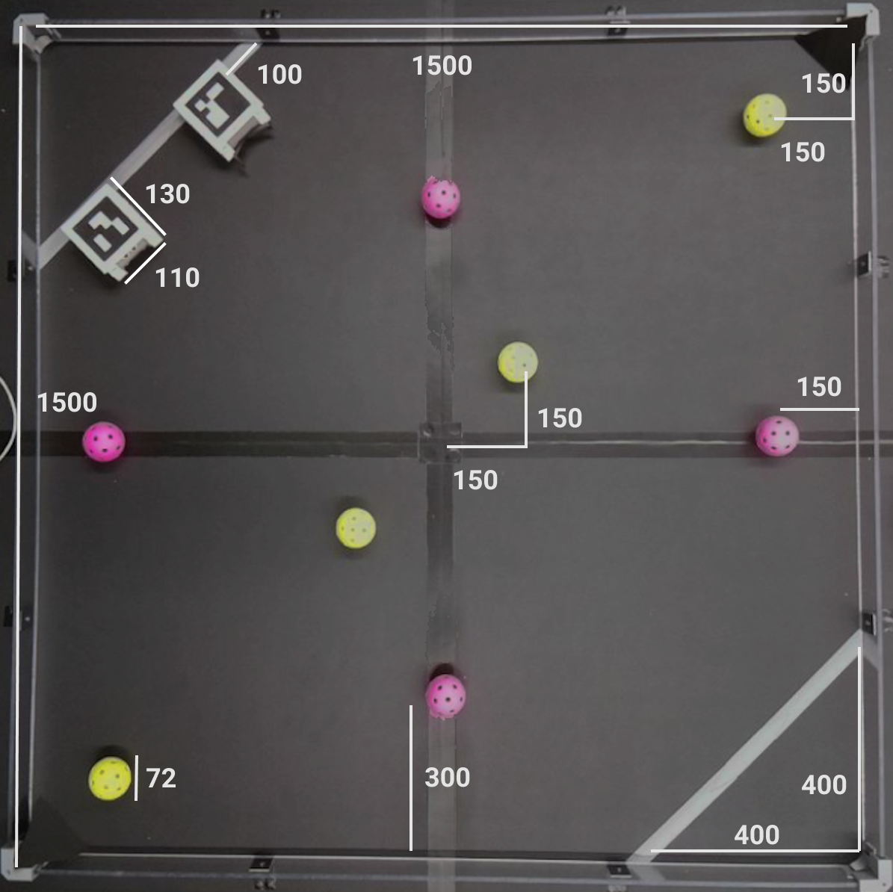

#  Micro Invaders 2020 Rules

Here are the rules for the event Micro Invaders 2020. Feel free to suggest rule changes by creating *an issue* or *a pull request*.

## Game Logic

The game is played between two teams battling each other in short 3 or 5 rounds showdowns. Each team has two autonomous robots playing for their side at a time. All teams  start with 0 points. Teams can either try to increase their points or decrease opponent’s pointst.

The points are increased by collecting positive energy cores, balls, to the team’s base and the points are lost by receiving negative energy cores or by receiving other penalties. A point is given when an energy core stays inside the base and does not bounce off. After point is given, the ball is removed from the base. Robots are not allowed to go intentionally inside their own base.

If the team receives 3 negative energy cores, their base is destroyed and the opponent wins. If both teams are alive at the end of a game, the team holding greater energy count will overpower their opponent and win. In case of a tie, the team that has collected most positive energy cores wins. If still tie, the team that collected energy cores faster wins.

The round ends after 2.5 minutes or if all energy cores are collected.

## Starting Setup

The game is played in a square-shaped 1.5x1.5m arena with multiple energy cores located on the arena. Two corners of the arena will function as bases, one for each team. At the start of each round the competing robots are placed in front of their base.

## Energy Cores

Energy cores are presented in the challenge as floorball balls in the area. The robots are able to push them around with ease.

Green cores = positive cores (gain +1 point).
Pink cores = negative cores (lose -1 point)

## Penalties

If a robot breaks down, gets tilted etc and the team wants to pull their robot out of the game arena during an ongoing round, the team may lose points. After the pull-out the robot can return to the arena from their starting position. Note that the time of the ongoing round won’t stop while team is fixing their robot.

## Robots

The team receives their robot model around 1 month before competition. 

Each team is responsible to 3D-print their own robots and their ArUco markers but the organizer are allowed to help and give e.g. spare parts if needed.

The color of the robot should be either black or white. Others colors can be used only if the colors cannot be seen at all from the top-down view camera.

Primarly, customizing the robot is not allowed. However, we may allow small adjustments for the robots, e.g. rounding some corners, modifying density of the tracks. Please, verify all modifications before doing them from from the organizers.

## Illustration

Illustration units are in centimeters, but overall image is not to accurate scale.

The game is played on a 1,5m x 1,5m square arena. Two opposing corners are designated as scoring areas for the blue and the red team.

The two corners marked with black, have small bumpers that prevent the balls from getting stuck in the corners, where the robots might have trouble retrieving them.

The balls / energy cores have a diameter of 7cm.

The robots are roughly 13cm x 11cm.

## Disclaimer

This competition main idea is to gather like-minded people together and have fun.

We encourage teams to help each other, and we, the organizers, are more than happy to help the teams to succeed.

No need to take this competition too seriously :)

Everything is subject to change.
